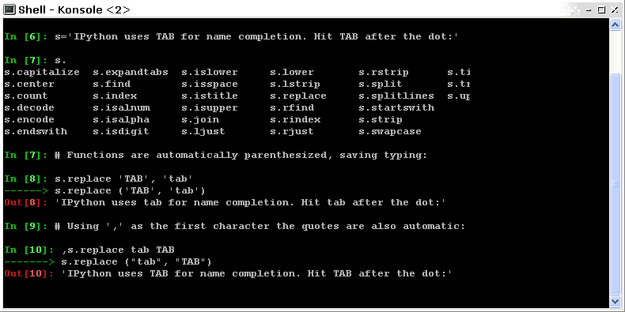
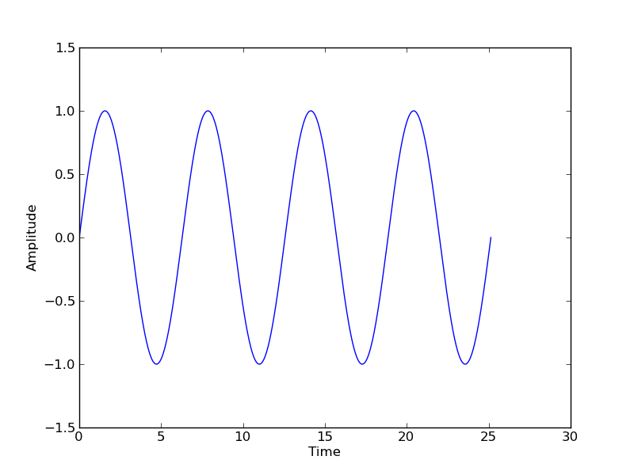
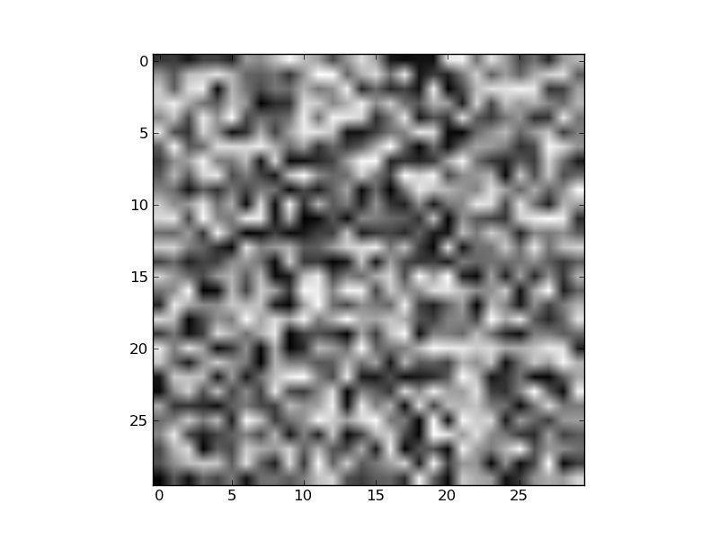
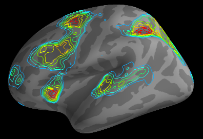

Intro to scientific Python in 45'
================================================================================

----

... or Python for Matlab Users
================================================================================

----

What you should be able to do
--------------------------------------------------------------------------------

... in 45mins
~~~~~~~~~~~~~~~~~~~~~~~~~~~~~~~~~~~~~~~~~~~~~~~~~~~~~~~~~~~~~~~~~~~~~~~~

- start Python
- do simple math
- basic scripting
- get started with linear algebra and scientific computing
- plotting

----

What use Python for?
--------------------------------------------------------------------------------

- scripting (like shell scripts e.g. bash, csh)
- make web sites (like these slides)
- **science** (like Matlab, IDL, R, Octave, Scilab)
- etc.

You just need to know 1 language to do almost everything !

----

Scientific Python building blocks
-----------------------------------

* **Python**, a generic and modern computing language

* **IPython**, an advanced **Python shell**: http://ipython.org/

* **Numpy** : provides powerful **numerical arrays** objects, and routines to
  manipulate them: http://www.numpy.org/

* **Scipy** : high-level data processing routines.
  Optimization, regression, interpolation, etc: http://www.scipy.org/

* **Matplotlib** a.k.a. Pylab: 2-D visualization, "publication-ready" plots
  http://matplotlib.sourceforge.net/

* **Mayavi** : 3-D visualization
  http://code.enthought.com/projects/mayavi/

----

First step
--------------------------------------------------------------------------------

Start the **Ipython** shell (from terminal or Windows cmd shell):

.. sourcecode:: bash

    $ ipython -pylab

Getting a scientific-Python environment:

* Comes with every Linux distribution
* Python(x,y) on Windows: http://www.pythonxy.com
* EPD: http://www.enthought.com/products/epd.php

----

Hello world!
--------------------------------------------------------------------------------

Start IPython:

.. sourcecode:: bash

    $ ipython -pylab

.. raw:: html

  

.. raw:: html

  

Once you have started the interpreter, type:

.. sourcecode:: python

    >>> print "Hello, world!"
    Hello, world!

----

Python basics: Numerical types
--------------------------------------------------------------------------------

Integer variables:

.. sourcecode:: python

    >>> 1 + 1
    2
    >>> a = 4

floats:

.. sourcecode:: python

    >>> c = 2.1

complex (a native type in Python!):

.. sourcecode:: python

    >>> a = 1.5 + 0.5j
    >>> a.real
    1.5
    >>> a.imag
    0.5

----

Python basics: Numerical types
--------------------------------------------------------------------------------

and booleans:

.. sourcecode:: python

    >>> 3 < 4
    True
    >>> test = (3 > 4)
    >>> test
    False
    >>> type(test)
    <type 'bool'>

Note that **you don't need to specify the type** of the variable

.. sourcecode:: C

    int a = 1;  # in C

----

Python basics: Numerical types
--------------------------------------------------------------------------------

Python can replace your pocket calculator with : ``+``, ``-``, ``*``, ``/``, ``%`` (modulo)

.. sourcecode:: python

    >>> 7 * 3.
    21.0
    >>> 2**10
    1024
    >>> 8 % 3
    2

**WARNING** : Integer division

.. sourcecode:: python

    >>> 3 / 2  # !!!
    1
    >>> 3 / 2.  # Trick: use floats
    1.5
    >>> 3 / float(2)  # type conversion
    1.5

----

Container types: list
--------------------------------------------------------------------------------

The *list* type:

.. sourcecode:: python

    >>> a = [1]

Or

.. sourcecode:: python

    >>> a = list()
    >>> a.append(1)
    [1]

Concatenation and access:

.. sourcecode:: python

    >>> a + a  # concatenation
    [1, 1]
    >>> a[0] = 2  # access 1st element (starts at 0!)
    [2, 1]
    >>> a[-1] = 0  # access last element
    [2, 0]

----

Container types: list
--------------------------------------------------------------------------------

* Slicing: obtaining sublists of regularly-spaced elements

.. sourcecode:: python

    >>> l = [1, 2, 3, 4, 5]
    >>> l[2:4]
    [3, 4]

Note that i is in ``l[start:stop]`` if ``start <= i < stop``

**Slicing syntax**: `l[start:stop:stride]`

.. sourcecode:: python

    >>> l[:3]  # first 3
    [1, 2, 3]
    >>> l[3:]  # from 3 to end
    [4, 5]
    >>> l[::2]
    [1, 3, 5]

----

Container types: list
--------------------------------------------------------------------------------

Reverse `l`:

.. sourcecode:: python

    >>> r = l[::-1]
    >>> r
    [5, 4, 3, 2, 1]

Sort (in-place):

.. sourcecode:: python

    >>> r.sort()
    >>> r
    [1, 2, 3, 4, 5]

``r.sort()`` or ``r.append(1)`` are examples of object-oriented programming (OOP).
Being a ``list``, the object `r` owns the *method* `function` that is called
using the notation **.**

That's all you need to know today.

----

Container types: string or ``str``
--------------------------------------------------------------------------------

.. sourcecode:: python

    >>> a = "hello, world!"
    >>> print a[2]
    'l'
    >>> a.replace('l', 'z', 1)
    'hezlo, world!'
    >>> a.replace('l', 'z')
    'hezzo, worzd!'

* String substitution:

.. sourcecode:: python

    >>> 'An integer: %i; a float: %f; a string: %s' % (1, 0.1, 'string')
    'An integer: 1; a float: 0.100000; another string: string'

Behaves very much like printf in C

.. sourcecode:: python

    >>> print "%03d" % 2  # print fixed size
    "002"

----

Python basics: data types
--------------------------------------------------------------------------------

A dictionary ``dict`` is basically an efficient table that **maps keys to
values**. It is an **unordered** container:

.. sourcecode:: python

    >>> phone = {'ellen': 5752, 'khaldoun': 5578}
    >>> phone['alex'] = 5915
    >>> phone
    {'khaldoun': 5578, 'alex': 5915, 'ellen': 5752}  # no order
    >>> phone['khaldoun']
    5578
    >>> phone.keys()
    ['khaldoun', 'alex', 'ellen']
    >>> phone.values()
    [5578, 5915, 5752]
    >>> 'ellen' in phone
    True

----

Getting help
--------------------------------------------------------------------------------

Start `ipython`:

.. sourcecode:: python

    >>> print('Hello world')
    Hello world
    >>> print?  # don't forget the ?
    Type:		builtin_function_or_method
    Base Class:	        <type 'builtin_function_or_method'>
    String Form:	<built-in function print>
    Namespace:	        Python builtin
    Docstring:
	print(value, ..., sep=' ', end='\n', file=sys.stdout)

	Prints the values to a stream, or to sys.stdout by default.
	Optional keyword arguments:
	file: a file-like object (stream); defaults to the current sys.stdout.
	sep:  string inserted between values, default a space.
	end:  string appended after the last value, default a newline.

-----

Numpy
--------------------------------------------------------------------------------

**Numpy** is:

    - an extension package to Python for multidimensional arrays (matrices in n-dimensions)

    - designed for **efficient** scientific computation

Example:

.. sourcecode:: python

     >>> import numpy as np
     >>> a = np.array([0, 1, 2, 3])
     >>> a
     array([0, 1, 2, 3])

Reference documentation: http://docs.scipy.org

-----

Numpy: Creating arrays
--------------------------------------------------------------------------------

* 1-D

.. sourcecode:: python

    >>> a = np.array([0, 1, 2, 3])
    >>> a
    array([0, 1, 2, 3])

Getting the size and dimensions of the array:

.. sourcecode:: python

    >>> a.ndim
    1
    >>> a.shape
    (4,)
    >>> len(a)
    4

-----

Numpy: Creating arrays
--------------------------------------------------------------------------------

* 2-D

.. sourcecode:: python

    >>> b = np.array([[0, 1, 2], [3, 4, 5]])    # 2 x 3 array
    >>> b
    array([[ 0,  1,  2],
           [ 3,  4,  5]])
    >>> b.ndim
    2
    >>> b.shape
    (2, 3)
    >>> len(b)     # returns the size of the first dimension
    2

* 3-D, ...

.. sourcecode:: python

    >>> c = np.array([[[1], [2]], [[3], [4]]])
    >>> c.shape
    (2, 2, 1)

.. In practice, we rarely enter items one by one...

-----

Numpy: Creating arrays
--------------------------------------------------------------------------------

* Evenly spaced:

.. sourcecode:: python

    >>> import numpy as np
    >>> a = np.arange(10) # 0 .. n-1  (!)
    >>> a
    array([0, 1, 2, 3, 4, 5, 6, 7, 8, 9])
    >>> b = np.arange(1, 9, 2) # start, end (exlusive), step
    >>> b
    array([1, 3, 5, 7])

* or by number of points:

.. sourcecode:: python

    >>> c = np.linspace(0, 1, 6)   # start, end, num-points
    >>> c
    array([ 0. ,  0.2,  0.4,  0.6,  0.8,  1. ])

-----

Numpy: Creating arrays
--------------------------------------------------------------------------------

* Common arrays: **ones**, **zeros** and **eye** (like in Matlab)

.. sourcecode:: python

    >>> a = np.ones((3, 3))
    >>> a
    array([[ 1.,  1.,  1.],
           [ 1.,  1.,  1.],
           [ 1.,  1.,  1.]])

.. sourcecode:: python

    >>> b = np.zeros((2, 2))
    >>> b
    array([[ 0.,  0.],
           [ 0.,  0.]])

.. sourcecode:: python

    >>> c = np.eye(3)
    >>> c
    array([[ 1.,  0.,  0.],
           [ 0.,  1.,  0.],
           [ 0.,  0.,  1.]])

-----

Numpy: Creating arrays
--------------------------------------------------------------------------------

* Random numbers:

.. sourcecode:: python

    >>> a = np.random.rand(4)              # uniform in [0, 1]
    >>> a
    array([ 0.58597729,  0.86110455,  0.9401114 ,  0.54264348])
    >>> b = np.random.randn(4)             # gaussian
    >>> b
    array([-2.56844807,  0.06798064, -0.36823781,  0.86966886])

In n-dimensions:

.. sourcecode:: python

    >>> c = np.random.rand(3, 3)
    >>> c
    array([[ 0.31976645,  0.64807526,  0.74770801],
           [ 0.8280203 ,  0.8669403 ,  0.07663683],
           [ 0.11527489,  0.11494884,  0.13503285]])

-----

Numpy: Basic data types
--------------------------------------------------------------------------------

.. sourcecode:: python

    >>> a = np.array([1, 2, 3])
    >>> a.dtype
    dtype('int64')

has a **different data type** than:

.. sourcecode:: python

    >>> b = np.array([1., 2., 3.])
    >>> b.dtype
    dtype('float64')

You can also choose:

.. sourcecode:: python

    >>> c = np.array([1, 2, 3], dtype=float)
    >>> c.dtype
    dtype('float64')

**Remark:** Much of the time you don't necessarily need to care, but remember they are there.

.. Remark: There are also other types (e.g. 'complex128', 'bool', etc.)

-----

Numpy : Indexing and slicing
--------------------------------------------------------------------------------

.. sourcecode:: python

    >>> a = np.diag(np.arange(5))
    >>> a
    array([[0, 0, 0],
           [0, 1, 0],
           [0, 0, 2]])
    >>> a[1, 1]
    1
    >>> a[2, 1] = 10  # third line, second column
    >>> a
    array([[ 0,  0,  0],
           [ 0,  1,  0],
           [ 0, 10,  2]])
    >>> a[1]  # takes the entire 2 second row !
    array([0, 1, 0, 0, 0])

-----

Numpy : Indexing and slicing
--------------------------------------------------------------------------------

Like Python lists arrays can be sliced:

.. sourcecode:: python

    >>> a = np.arange(10)
    >>> a
    array([0, 1, 2, 3, 4, 5, 6, 7, 8, 9])
    >>> a[2:9:3]  # [start:end:step]
    array([2, 5, 8])
    >>> a[::2]  # every 2 elements
    array([0, 2, 4, 6, 8])

-----

Numpy : Copies and views
--------------------------------------------------------------------------------

* A slicing operation creates a **view** on the original array
* **the original array is not copied in memory**.
* **When modifying the view, the original array is modified as well**:

.. sourcecode:: python

    >>> a = np.arange(10)
    >>> a
    array([0, 1, 2, 3, 4, 5, 6, 7, 8, 9])
    >>> b = a[::2]; b
    array([0, 2, 4, 6, 8])
    >>> b[0] = 12
    >>> b
    array([12,  2,  4,  6,  8])
    >>> a   # no copy !!!
    array([12,  1,  2,  3,  4,  5,  6,  7,  8,  9])

-----

Numpy : Copies and views
--------------------------------------------------------------------------------

If you want a copy you have to specify it:

.. sourcecode:: python

    >>> a = np.arange(10)
    >>> b = a[::2].copy()  # force a copy
    >>> b[0] = 12
    >>> a
    array([0, 1, 2, 3, 4, 5, 6, 7, 8, 9])

This behavior can be surprising at first sight...

but it allows to **save both memory and time**.

-----

Numpy: file formats
--------------------------------------------------------------------------------

Numpy has its own format:

.. sourcecode:: python

    >>> np.save('pop.npy', data)
    >>> data3 = np.load('pop.npy')

But supports well-known (& more obscure) file formats:

* Matlab: ``scipy.io.loadmat``, ``scipy.io.savemat``
* HDF5: `h5py <http://code.google.com/p/h5py/>`__, `PyTables <http://pytables.org>`__
* NetCDF: ``scipy.io.netcdf_file``, `netcdf4-python <http://code.google.com/p/netcdf4-python/>`__, ...
* MatrixMarket: ``scipy.io.mmread``, ``scipy.io.mmread``

-----

Numpy : linear algebra
--------------------------------------------------------------------------------

Matrix multiplication:

.. sourcecode:: python

    >>> a = np.triu(np.ones((3, 3)), 1)   # see help(np.triu)
    >>> a
    array([[ 0.,  1.,  1.],
           [ 0.,  0.,  1.],
           [ 0.,  0.,  0.]])
    >>> b = np.diag([1, 2, 3])
    >>> a.dot(b)
    array([[ 0.,  2.,  3.],
           [ 0.,  0.,  3.],
           [ 0.,  0.,  0.]])
    >>> np.dot(a, a)
    array([[0, 0, 1],
           [0, 0, 0],
           [0, 0, 0]])

Transpose:

.. sourcecode:: python

    >>> a_transposed = a.T  # no copy !

-----

Numpy : linear algebra
--------------------------------------------------------------------------------

Inverses and linear equation systems:

.. sourcecode:: python

    >>> from numpy import linalg  # OR
    >>> from scipy import linalg  # even better
    >>> A = a + b
    >>> A
    array([[ 1.,  1.,  1.],
           [ 0.,  2.,  1.],
           [ 0.,  0.,  3.]])
    >>> B = linalg.inv(A)
    >>> B.dot(A)
    array([[ 1.,  0.,  0.],
           [ 0.,  1.,  0.],
           [ 0.,  0.,  1.]])
    >>> x = linalg.solve(A, [1, 2, 3])  # linear system
    >>> U, s, V = linalg.svd(A)  # SVD
    >>> vals = np.linalg.eigvals(A)  # Eigenvalues

-----

Numpy : reductions
--------------------------------------------------------------------------------

Computing sums:

.. sourcecode:: python

    >>> x = np.array([1, 2, 3, 4])
    >>> np.sum(x)  # or x.sum()
    10

Sum by rows and by columns:

.. sourcecode:: python

    >>> x = np.array([[1, 1], [2, 2]])
    >>> x.sum(axis=0)   # columns (first dimension)
    array([3, 3])
    >>> x[:,0].sum(), x[:,1].sum()
    (3, 3)
    >>> x.sum(axis=1)   # rows (second dimension)
    array([2, 4])

Same with ``np.mean, np.argmax, np.argmin, np.min, np.max, np.cumsum, np.sort`` etc.

-----

Visualization with Python
--------------------------------------------------------------------------------

.. sourcecode:: python

    >>> import pylab as pl
    >>> t = np.linspace(0, 8 * np.pi, 1000)
    >>> x = np.sin(t)
    >>> pl.plot(t, x)
    >>> pl.xlabel('Time')
    >>> pl.ylabel('Amplitude')
    >>> pl.ylim([-1.5, 1.5])
    >>> pl.show()
    >>> pl.savefig('pylab_demo.pdf')  # natively save pdf, svg, png etc.

.. raw:: html

  

.. raw:: html

  

-----

Visualization with Python
--------------------------------------------------------------------------------

* 2-D (such as images)

.. sourcecode:: python

    >>> image = np.random.rand(30, 30)
    >>> pl.imshow(image)
    >>> pl.gray()
    >>> pl.show()

.. raw:: html

  

.. raw:: html

  

-----

Visualization with Python
--------------------------------------------------------------------------------

* 3-D with Mayavi

.. raw:: html

  

.. raw:: html

  

Check out: http://pysurfer.github.com/

-----

My first script
--------------------------------------------------------------------------------

Let's say the file ``my_script.py`` contains:

.. sourcecode:: python

    s = 'hello world!'
    print s

In IPython:

.. sourcecode:: ipython

    In [1]: %run my_script.py
    Hello world!

    In [2]: s
    Out[2]: 'Hello world!'

    In [3]: %whos
    Variable   Type    Data/Info
    ----------------------------
    s          str     Hello world!

-----

Scipy
--------------------------------------------------------------------------------

* ``scipy`` contains various toolboxes dedicated to common issues in
  scientific computing.

* ``scipy`` can be compared to other standard scientific-computing
  libraries, such as the GSL (GNU Scientific  Library for C and C++),
  or Matlab's toolboxes.

* ``scipy`` is the core package for scientific
  routines in Python

* ``scipy`` it is meant to operate efficiently on ``numpy`` arrays.

-----

Scipy
--------------------------------------------------------------------------------

* ``scipy.io``  for IO (e.g. read / write Matlab files)
* ``scipy.linalg``  for optimized linear algebra
* ``scipy.stats``  for basic stats (t-tests, simple anova, ranksum etc.)
* ``scipy.signal``  for signal processing
* ``scipy.sparse``  for sparse matrices
* ``scipy.fftpack``  for FFTs
* ``scipy.ndimage``  for N-D image processing (e.g., smoothing)
* etc.

-----

Scipy: example of ``scipy.io``
--------------------------------------------------------------------------------

* Loading and saving Matlab files:

    >>> from scipy import io
    >>> struct = io.loadmat('file.mat', struct_as_record=True)
    >>> io.savemat('file.mat', struct)

-----

Scipy: example of ``scipy.stats``
--------------------------------------------------------------------------------

A T-test to decide whether the two sets of observations have different means:

.. sourcecode:: ipython

    >>> a = np.random.normal(0, 1, size=100)
    >>> b = np.random.normal(1, 1, size=10)
    >>> stats.ttest_ind(a, b)
    (-2.389876434401887, 0.018586471712806949)

The resulting output is composed of:

    * The T statistic value

    * the *p value*

-----

Basics of control flow
--------------------------------------------------------------------------------

* if/elif/else

.. sourcecode:: python

    >>> a = 10
    >>> if a == 1:
    >>>     print(1)
    >>> elif a == 2:
    >>>     print(2)
    >>> else:
    >>>     print('A lot')

**Blocks are delimited by indentation**

-----

Basics of control flow
--------------------------------------------------------------------------------

* for loops

.. sourcecode:: python

    >>> for word in ['cool', 'powerful', 'readable']:
    >>>     print('Python is %s' % word)
    >>>
    Python is cool
    Python is powerful
    Python is readable

**you can iterate or lists, arrays, dict etc.**

-----

My first function
--------------------------------------------------------------------------------

Functions start with **def**:

.. sourcecode:: python

    >>> def disk_area(radius):
    >>>     return 3.14 * radius * radius
    >>>
    >>> disk_area(1.5)
    7.0649999999999995

-----

My second function
--------------------------------------------------------------------------------

**Arguments are not copied** when passed to a function (not like with Matlab)

.. sourcecode:: python

    >>> def foo(a):
    >>>     a.append(1)
    >>> 
    >>> a = [0]
    >>> foo(a)
    >>> print a  # a has been modified !!!
    [0, 1]

-----

Getting started at the Martinos
--------------------------------------------------------------------------------

... tomorrow
~~~~~~~~~~~~~~~~~~~~~~~~~~~~~~~~~~~~~~~~~~~~~~~~

In a terminal do:

.. sourcecode:: tcsh

    $ setenv PATH /usr/pubsw/packages/python/epd/bin:${PATH}

If you use Bash replace the previous instruction with:

.. sourcecode:: bash

    $ export PATH=/usr/pubsw/packages/python/epd/bin:${PATH}

Then start the python interpreter with:

.. sourcecode:: bash

    $ ipython -pylab

-----

Learn more
--------------------------------------------------------------------------------

On the language

- List Comprehensions
- Classes and objects with methods

On Numpy:

- Broadcasting similar to ``bsxfun`` in Matlab.
- Fancy indexing
- Fortran or C ordered arrays

-----

Learn more
--------------------------------------------------------------------------------

- http://scipy-lectures.github.com
- http://www.scipy.org/NumPy_for_Matlab_Users

For a Matlab like IDE environment

- http://packages.python.org/spyder

Parallel computing:

- http://packages.python.org/joblib

MEG and EEG data analysis:

- http://martinos.org/mne
